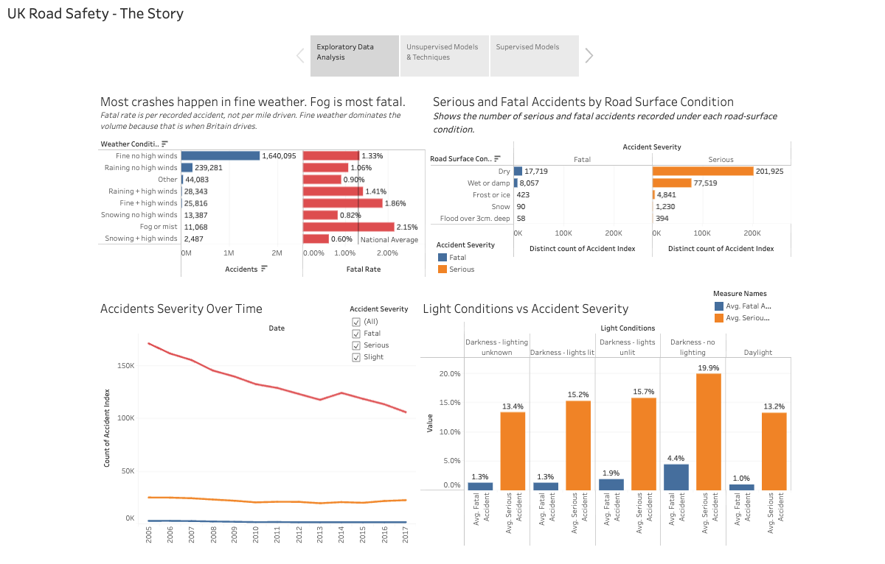
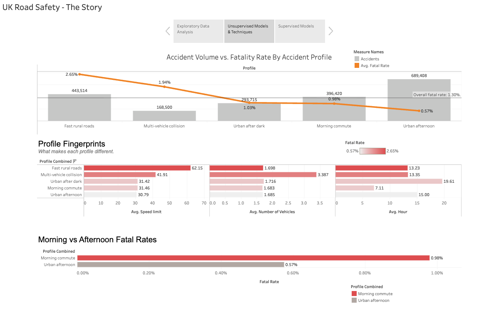
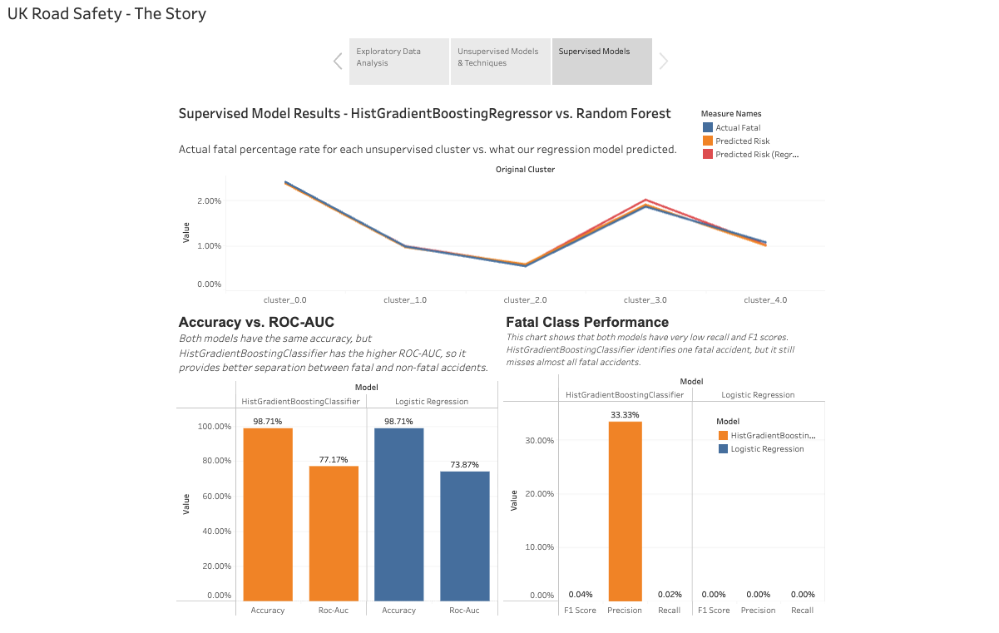

# UK Road Safety: A Machine Learning Pipeline

We are diving into the official **UK Road Safety Dataset** from the [UK Department for Transport](https://www.kaggle.com/datasets/tsiaras/uk-road-safety-accidents-and-vehicles/data) to uncover hidden patterns behind over a decade of traffic incidents.

Our mission? Turn messy, multi-million-rows of data into a machine learning pipeline and an interactive dashboard that helps stakeholders identify patterns associated with more severe road accidents and prioritize areas for further safety investigation.

## Stakeholders

- **Primary Stakeholders:** Department of Transportation planners, road safety engineers, and emergency services dispatch directors in the United Kingdom.
- **Usage:** Stakeholders can use these risk profiles to intelligently deploy highway patrols, optimize speed limits, and allocate emergency response

## Tools & Technologies Used

- **Programming Language:** Python
- **Machine Learning Libraries:** `scikit-learn` (specifically `HistGradientBoostingRegressor`, `RandomForestRegressor`, and `SimpleImputer`)
- **Data Wrangling:** `pandas` and `numpy`
- **Data Visualization & Dashboards:** Tableau Public / Tableau Desktop

## High-Level Methodology

- **Data Prep & Join:** Cleaned raw data, turned them into `accidents_clean.csv` and `vehicles_clean.csv`. Each member did exploratory data analysis to understand patterns and trends
  . Created a main EDA file to display unique findings.

- **Unsupervised Profiling:** Grouped thousands of rows into five clean, distinct driving environments using clustering algorithms.

- **Supervised Risk Modeling:** Trained and compared supervised models(regression and classfication) to predict a continuous accident fatality risk percentage.

- **Interactive Dashboarding:** Exported final aggregated results into a lightweight Tableau dashboard to visually track model accuracy and trends.

---

## Our Team & Individual Contributions

| Member                      | Primary responsibility                                                                                                                                                                                                                                                                                                                                | Where to see it                                                                                                                                                                                                                                             |
| --------------------------- | ----------------------------------------------------------------------------------------------------------------------------------------------------------------------------------------------------------------------------------------------------------------------------------------------------------------------------------------------------- | ----------------------------------------------------------------------------------------------------------------------------------------------------------------------------------------------------------------------------------------------------------- |
| **Leomary Rodriguez**       | Built the cleaning pipeline for both raw files — the hidden-missing-value fix, type parsing and join logic that every other notebook depends on. Led EDA on severity, speed limit, lighting, weather, driver age and time trends. Co-built the unsupervised clustering. Contributed to the Tableau dashboard. Wrote a large part of the Final Report. | [`notebooks/leomary_eda.ipynb`](notebooks/leomary_eda.ipynb) · [`models/unsupervised_clustering.ipynb`](models/unsupervised_clustering.ipynb) · [`report/final_report.ipynb`](report/final_report.ipynb)                                                    |
| **Oluwafikunayomi Adeniji** | EDA on the severity distribution and how severity varies with speed limit, light conditions and urban vs rural setting. Co-built the unsupervised clustering. Contributed to the Tableau dashboard.                                                                                                                                                   | [`notebooks/oluwafikunayomi_eda.ipynb`](notebooks/oluwafikunayomi_eda.ipynb) · [`models/unsupervised_clustering.ipynb`](models/unsupervised_clustering.ipynb)                                                                                               |
| **Amina Jobarteh**          | Led project management and technical documentation goals. Built EDA on day of week, journey purpose, weather conditions and severity over time. Built the supervised model, and wrote the supervised sections of the Final Report. Assembled and finalised the Tableau dashboard.                                                                     | [`notebooks/amina_ukeda.ipynb`](notebooks/amina_ukeda.ipynb) · [`models/supervised_regression.ipynb`](models/supervised_regression.ipynb) · **[Dashboard](https://public.tableau.com/app/profile/amina.jobarteh/viz/UKRoadSafety_17877843524320/Findings)** |
| **Ye (Morris) Ou**          | EDA on road and vehicle factors — road surface conditions, junction detail, vehicle manoeuvre and vehicle age — and how each relates to accident severity. Contributed to the Tableau dashboard and to the supervised sections of the Final Report.                                                                                                   | [`notebooks/morris_eda.ipynb`](notebooks/morris_eda.ipynb) [`models/supervised_regression.ipynb`](models/supervised_regression.ipynb) ·                                                                                                                     |

All four contributed findings to [`notebooks/main_eda.ipynb`](notebooks/main_eda.ipynb), the collected
team EDA, and all four contributed views to the Tableau dashboard, which Amina assembled and
finalised.

---

## Repository Structure

```text
├── README.md
├── requirements.txt
├── data/
│   ├── README.md                       ← one-time data setup (CSVs are gitignored)
│   ├── raw/                            ← Accident_Information.csv, Vehicle_Information.csv
│   └── preprocessed/
│       ├── accidents_clean.csv
│       ├── vehicles_clean.csv
│       └── accident_clusters.csv.gz    ← cluster labels, small enough to commit
├── notebooks/
│   ├── leomary_eda.ipynb               ← cleaning pipeline + EDA
│   ├── oluwafikunayomi_eda.ipynb
│   ├── amina_ukeda.ipynb
│   ├── morris_eda.ipynb
│   └── main_eda.ipynb                  ← collected team findings
├── models/
│   ├── unsupervised_clustering.ipynb   ← KMeans, five accident profiles
│   └── supervised_regression.ipynb     ← predicts fatality risk
├── dashboard/
│   └── screenshots/                    ← Tableau Public dashboard captures
└── report/
    ├── final_report.ipynb              ← the full write-up
    └── figures/                        ← charts used in the report
```

**Note on the data.** The raw and cleaned CSVs are ~2.4 GB combined and GitHub caps files at 100 MB,
so they are gitignored — see [`data/README.md`](data/README.md) for the one-time setup. The only
data file in the repo is `accident_clusters.csv.gz`, which is small enough to commit so the
supervised notebook can read it after a `git pull`.

---

## Key Findings / Results

- Accident severity was highly imbalanced: approximately **84.7% of accidents were slight, 14.0% were serious, and 1.3% were fatal**.
- Accident severity varied meaningfully across road conditions. Accidents on **60 mph roads** had one of the highest proportions of serious and fatal outcomes.
- Lighting conditions were associated with severity. Accidents occurring in **darkness with no lighting** had a fatality rate of approximately **4.39%**, compared with about **1.03% in daylight**.
- Rural accidents were more severe than urban accidents. Rural accidents had a fatality rate of approximately **2.35%**, compared with **0.71% in urban areas**.
- KMeans clustering identified **five interpretable accident profiles**: fast rural roads, morning commute, urban afternoon, multi-vehicle collisions, and urban after dark.
- Fatality rates differed substantially across these profiles, ranging from **0.57% for urban afternoon accidents to 2.65% for fast rural-road accidents**, a roughly **4.6x difference**.
- The largest cluster, urban afternoon accidents, had the lowest fatality rate, while fast rural-road accidents had the highest. This demonstrates that accident volume and accident severity are not the same thing.
- The regression model's (HistGradientBoosting & Random Forest) predicted risk percentages land close to the actual fatality rates for every single cluster.
- Both regression model's correctly identified cluster 2 as the safest profile, and cluster 0 as the most fatal profile.
- Both regression models performed well in terms of average error. The HistGradientBoosting model made mistakes in overall risk by an average of just 2.50% (MAE = 0.02500), slightly beating out the RandomForest model's 2.51%.
- HistGradient Regressor model had the higher predictive power as the model achieved an \(R^{2}\) score of 0.01551, which is roughly 5 times higher than the RandomForest score of 0.00308.

## Tableau Dashboard Link & Screenshots

**[View the live interactive dashboard on Tableau Public →](https://public.tableau.com/app/profile/amina.jobarteh/viz/UKRoadSafety_17877843524320/Findings)**

The dashboard is built as a three-part story: exploratory findings, the unsupervised accident
profiles, and the supervised model results.







## Recommendations / Implications

- Road-safety interventions should give additional attention to **high-speed rural roads**, which showed the highest fatality rate among the accident profiles identified through clustering.
- Poorly lit roads should be investigated for potential improvements in **street lighting, visibility, signage, and nighttime safety measures**.
- Multi-vehicle collision environments may benefit from targeted traffic-management strategies because this profile had the second-highest fatality rate.
- The five accident profiles can be used as a segmentation lens for future road-safety analysis and should be tested as engineered features in supervised modeling.
- Stakeholders should interpret fatality rates as the severity of accidents **after a crash has occurred**, rather than as the probability that a crash will occur under those conditions.
- Stakeholders could possibly reduce speed limit on fast rural roads, or increase in vehichle awareness when using fast rural roads.
- Regression and classification models should undergo multiple approcahes before deciding which one's should go into production.

## Brief Limitations & Next Steps

- The dataset contains only recorded accidents, not journeys where no accident occurred. Therefore, the analysis measures how severe crashes were under different conditions, not the probability of crashing in those conditions.
- Approximately **2.7% of records** were removed from the clustering analysis because they were missing one or more selected features. These missing records may not be random.
- KMeans is designed primarily for continuous, roughly spherical clusters. Because seven of the ten clustering features were categorical and required one-hot encoding, the resulting clusters showed some overlap.
- The number of clusters was selected using both statistical metrics and interpretability. Although `k=2` had the highest silhouette score, `k=5` produced more useful and distinguishable accident profiles.
- A future analysis could compare KMeans with methods designed for mixed numerical and categorical data, such as **K-Prototypes**.
- Future supervised modeling should continue testing whether the engineered cluster feature improves performance compared with models using the original features alone.
- For Supervised Model (Regression) Limitations:
- **Extreme Real-World Chaos:** Low R² scores prove car crashes are highly unpredictable. The model estimates general group risk but cannot predict individual luck.

- **Imputed Data Bias:** Random Forest requires filling missing data. Using column medians adds artificial values, which introduces slight guessing bias.

- **Severe Class Imbalance:** Fatal accidents are rare events. The model has few examples to study, making individual spikes hard to catch.

- **Missing Environmental Context:** The dataset lacks real-time variables like bad weather, driver distraction, and holiday traffic surges.

## Link to Full Final Report

For an in-depth review of our preprocessing decisions, modelling choices, full results and limitations, read the complete **[Final Report](report/final_report.ipynb)**.

## Technical Documentation

[Link to technical documentation](https://docs.google.com/document/d/1mTE3dQR2DN53zp_1rRHDQfr3lZKiANL5XzOiFEkxyQc/edit?tab=t.0)

## Data Source: Quick Start Guide

The data is the UK Department for Transport's road safety collection, published on
[Kaggle](https://www.kaggle.com/datasets/tsiaras/uk-road-safety-accidents-and-vehicles). It covers
**2,047,256 accidents recorded across Great Britain between 2005 and 2017**, together with
2,177,205 vehicle records (2004–2016), in two files joined on `Accident_Index`.

### Clone the Repo

```bash

git clone https://github.com/AmiJoba22/uk_road_safety_datapipe.git
cd uk_road_safety_datapipe
```

### Fetch the Data

Download the data directly from [Kaggle](https://www.kaggle.com/datasets/tsiaras/uk-road-safety-accidents-and-vehicles/data), drop the raw files into `data/raw/`, and step through the notebooks sequentially!

The CSVs are too large to commit (GitHub caps files at 100 MB), so they are gitignored and every clone starts empty. See **[`data/README.md`](data/README.md)** for the full one-time setup and the path convention all notebooks use.
